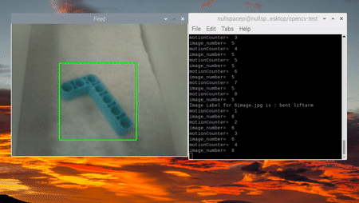
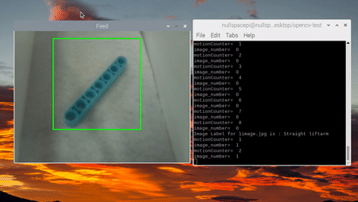

# Lego motion detection and image classification

Repository containing software code for a lego technic sorting machine trained using a deep learning model. 

The files in the computer folder are meant for use on your own computer. You can create and train your own deep learning model using your own data and also test this model on your computer. The model was trained on Google colab, so create_training_data_array.py was used to upload data in the form of a numpy array to Google colab. After transfering the tflite model to your Pi, you can then run the image classification file in the raspberry-pi folder to detect and classify lego pieces in real time.

Our model was trained with 6000 images across 7 different categories of lego technic pieces. It achieved 93% testing accuracy and graphs of the accuracy and loss are shown below. A confusion matrix was also plotted to visualize the performance of the classification algorithm. It depicts the count value of true versus false predictions across each category.

More images can be taken by editing the motion_detection_and_image_classification.py script.

The motion detection portion of the RaspberryPi script was adapted from pyimagesearch's project 'Building a Raspberry Pi security camera with OpenCV' and can be found at
https://pyimagesearch.com/2019/03/25/building-a-raspberry-pi-security-camera-with-opencv/

Depicted below are 2 examples of lego pieces being classified by the model through the Raspberry Pi's Picamera livestream. 

 &nbsp 

